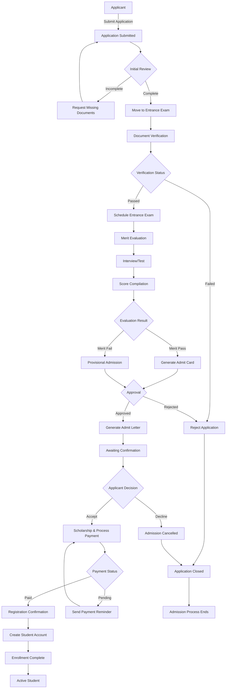

# Admission Workflow

## Overview

The admission workflow manages the complete process of admitting students into the institution. It encompasses application submission, verification, evaluation, and final admission decision.

## Workflow Stages

### 1. Application Submission
- Applicant submits admission application
- Application form collection and initial data entry
- Document submission and verification

### 2. Application Review
- Initial eligibility check
- Document verification
- Completeness validation

### 3. Assessment & Evaluation
- Merit evaluation
- Interview/Test assessment
- Qualification verification

### 4. Decision Making
- Merit ranking
- Admission decision approval
- Waitlist assignment if required

### 5. Admission Confirmation
- Admission letter generation
- Fee acceptance
- Registration completion

### 6. Enrollment
- Final confirmation
- Document collection
- Student account creation

## Key Actors

- **Applicant**: Submits application and documents
- **Admission Officer**: Reviews and processes applications
- **Evaluation Committee**: Assesses merit and qualifications
- **Admission Manager**: Approves final decisions
- **Finance Officer**: Processes fees and payments

## Workflow Diagram

## Status Transitions

| Current Status | Next Status | Condition |
|---|---|---|
| Draft | Application Submitted | Application form completed |
| Application Submitted | Under Review | Initial eligibility met |
| Under Review | Assessment | All documents verified |
| Assessment | Decision Pending | Assessment completed |
| Decision Pending | Admission Offered | Merit criteria met |
| Admission Offered | Confirmed | Applicant accepts offer |
| Confirmed | Registered | Payment received |
| Registered | Enrolled | Registration finalized |
| Under Review | Rejected | Eligibility failed |
| Any | Cancelled | Applicant withdraws |

## Related DocTypes

- **Applicant**: Stores applicant information
- **Admission Application**: Main admission form
- **Assessment**: Evaluation records
- **Admission Decision**: Final decision document
- **Admission Letter**: Generated offer letter
- **Student**: Final enrolled student record

## Notes

- Applicants can track their application status in real-time
- Automated notifications sent at each stage transition
- Documents must meet specified criteria for verification
- Merit evaluation follows institution's defined criteria
- Payment must be completed within specified timeframe
- Waitlist management for oversubscribed programs
